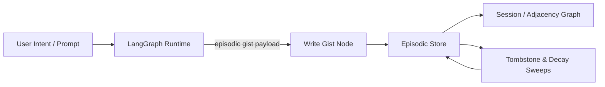

# Architecture & Design Rationale

## System Diagram
```mermaid
graph TB
    subgraph Frontend
        FE[React App / UI]
        Browser[Browser Client]
    end

    subgraph API
        API[FastAPI Adapter\n(src/api.py)]
        Auth[Auth / Request Validation]
        Router[Routing to LangGraph]
    end

    subgraph Runtime
        MainGraph[LangGraph Runtime\n(src/main_graph/main.py)]
        SemanticNode[Semantic Memory Node]
        EpisodicNode[Episodic Memory Node]
        ProceduralNode[Procedural Store Node]
        StagingNode[Semantic Staging Buffer Node]
        Consolidator[Consolidation Workers]
        Retriever[Retriever / Search Layer]
    end

    subgraph Database
        DB[(PostgreSQL + pgvector)]
    end

    subgraph External
        QwenCloud[Qwen Cloud LLM]
    end

    FE -->|POST /api/chat| API
    API -->|validated request| Auth
    Auth --> Router
    Router -->|invoke agent| MainGraph

    MainGraph -->|store/retrieve| SemanticNode
    MainGraph -->|store/retrieve| EpisodicNode
    MainGraph -->|store/retrieve| ProceduralNode
    MainGraph -->|stage semantic input| StagingNode
    MainGraph -->|call retrieval| Retriever
    MainGraph -->|dispatch consolidation| Consolidator

    SemanticNode --> DB
    EpisodicNode --> DB
    ProceduralNode --> DB
    StagingNode --> DB
    Retriever --> DB

    MainGraph -->|LLM prompt| QwenCloud
    QwenCloud -->|response| MainGraph
    MainGraph -->|final response| API
    API -->|HTTP response| FE
```

## Component Flow
- `React App / UI` sends chat requests to the FastAPI adapter at `POST /api/chat`.
- The adapter validates input and forwards it into the LangGraph runtime.
- The runtime uses the semantic, episodic, and procedural persistence nodes to read and write memory.
- New semantic facts are written to the staging buffer, where consolidation workers later adjudicate and commit them.
- Retrieval nodes query PostgreSQL with `pgvector` index support to surface relevant beliefs, memories, and procedural skills.
- The LangGraph runtime calls Qwen Cloud for LLM responses and merges the result into the final API response.

## Consolidation Pipelines
### Semantic Consolidation

```mermaid
graph LR
    UserIntent[User Intent / Prompt]
    MainGraph[LangGraph Runtime]
    SemanticWriter[Semantic Buffer Writer]
    Staging[Semantic Staging Buffer]
    Adjudication[Adjudication Engine]
    Bitemporal[Bitemporal Split]
    ActiveBeliefs[Active Beliefs Store]

    UserIntent --> MainGraph
    MainGraph -->|semantic memory candidates| SemanticWriter
    SemanticWriter --> Staging
    Staging -->|unconsolidated facts| Adjudication
    Adjudication --> Bitemporal
    Bitemporal --> ActiveBeliefs
    ActiveBeliefs -->|query| Retriever
```

- The runtime writes semantic facts into `staging_buffer` instead of immediately mutating `active_beliefs`.
- `adjudication.py` compares new facts against existing beliefs, resolves conflicts, and prepares approved updates.
- `bitemporal_split.py` applies temporal history rules, moves superseded facts to audit trails, and commits current facts in `active_beliefs`.

### Episodic Consolidation

- Episodic events are turned into `episodic_gists` and stored with session metadata.
- The pipeline maintains temporal adjacency graphs for sequential reasoning and replay.
- Background sweeps regularly decay old episodic importance scores and tombstone stale gist contents.

## Design Rationale

### Memory Decay Formula
We utilize a hybrid Ebbinghaus decay model:
$$S(t) = e^{-\lambda \cdot t}$$
- **Episodic Memory Rate**: Higher decay rate ($\lambda_{epi}$) to quickly clear conversation noise.
- **Semantic Memory Rate**: Lower decay rate ($\lambda_{sem}$) with frequency reinforcement to lock in established research facts.

### Fusion Weights
Retrieval combines vector search, BM25 keyword matching, and NetworkX graph connectivity:
$$Score = w_{vec} \cdot S_{vector} + w_{bm25} \cdot S_{bm25} + w_{graph} \cdot S_{graph}$$
where $w_{vec} = 0.5$, $w_{bm25} = 0.3$, and $w_{graph} = 0.2$.
