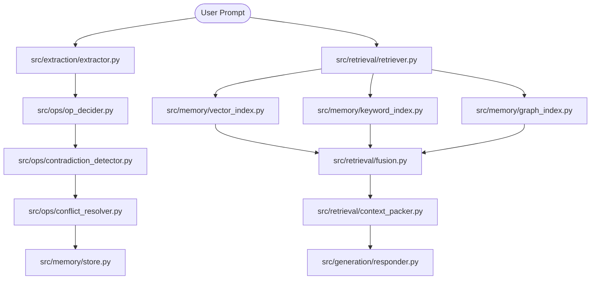

# Architecture & Design Rationale

## System Diagram

## Design Rationale

### Memory Decay Formula
We utilize a hybrid Ebbinghaus decay model:
$$S(t) = e^{-\lambda \cdot t}$$
- **Episodic Memory Rate**: Higher decay rate ($\lambda_{epi}$) to quickly clear conversation noise.
- **Semantic Memory Rate**: Lower decay rate ($\lambda_{sem}$) with frequency reinforcement to lock in established research facts.

### Fusion Weights
Retrieval combines vector search, BM25 keyword matching, and NetworkX graph connectivity:
$$Score = w_{vec} \cdot S_{vector} + w_{bm25} \cdot S_{bm25} + w_{graph} \cdot S_{graph}$$
where $w_{vec} = 0.5$, $w_{bm25} = 0.3$, and $w_{graph} = 0.2$.
